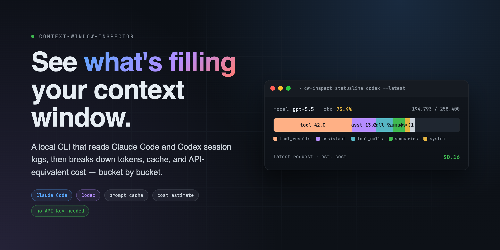
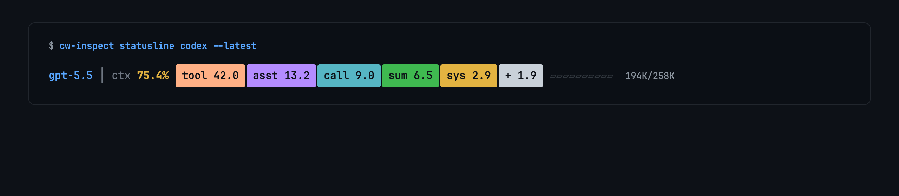
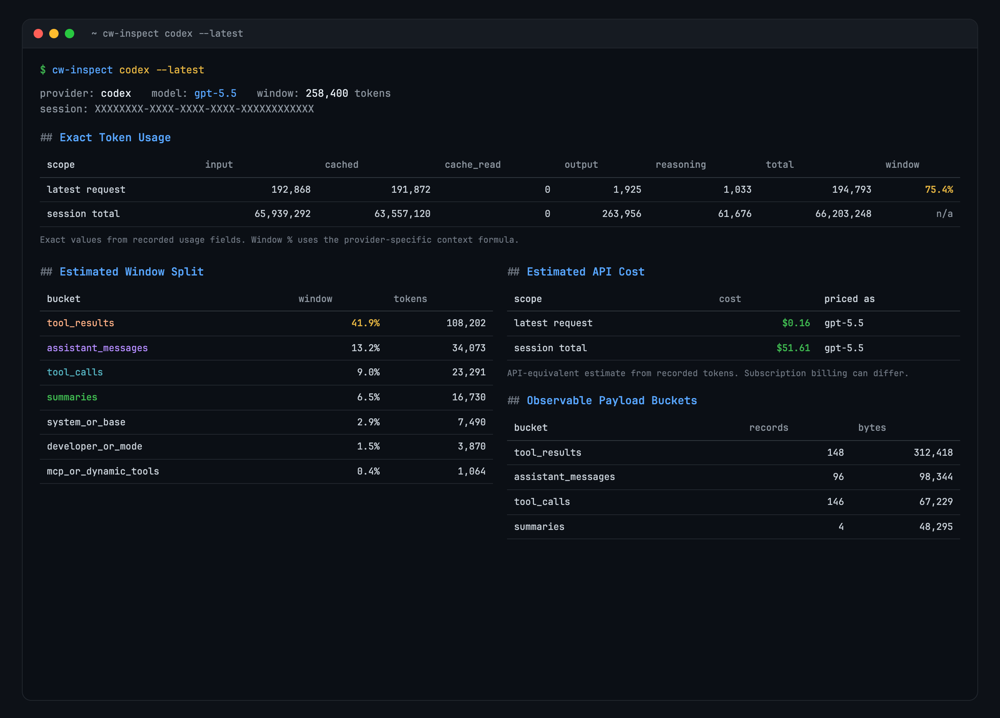

<div align="center">
  
</div>

<h1 align="center">Context Window Inspector</h1>

<p align="center">
  <a href="https://github.com/androidZzT/context-window-inspector/releases"></a>
  <a href="https://www.python.org/"></a>
  <a href="LICENSE"></a>
  <a href="https://github.com/androidZzT/context-window-inspector/stargazers"></a>
</p>

<p align="center">
  本地读取 Claude Code / Codex 会话日志，告诉你 <strong>token 都花到哪去了</strong> —— 按桶拆分、带缓存命中、附 API 等价成本。
</p>

<p align="center">
  <a href="README.md">English</a> · <strong>简体中文</strong>
</p>

---

## 为什么写这个

跑 Claude Code 或者 Codex，context 进度条一路涨到 80%，agent 开始变慢——你大概率不知道里面到底塞了什么。是 tool result 太多？还是某个 MCP server 一直挂着没下？或者一堆很久前的 summary？

`cw-inspect` 直接读 CLI 自己写在本地的 JSONL 日志，告诉你：

- **精确数字**：input / cached / cache write / cache read / output / reasoning，全部来自 `usage` 字段，不做估算。
- **大致归因**：按桶拆，tool 结果、assistant 消息、tool 调用、system prompt、summary、hook、skill、MCP 工具各算各的。
- **API 等价成本**：按公开模型价格，给每次请求和整段会话算一笔账。

不要 API key，不联网，只读你硬盘上已经存在的文件。

> ⭐ 如果它帮你省了一次「context 怎么这么满」的排查，麻烦点个 star，让其他 Claude Code / Codex 用户也能找到。

## Statusline 一眼看全

<div align="center">
  
</div>

一行带颜色的进度条，可以接进 Claude Code 的 `statusLine`，也能直接在 shell 里打印。最宽的那段一般是 `tool`——这是个信号。

截图是代表性的终端渲染效果；实际数值和表格宽度会随 session、模型、终端宽度和当前 transcript 内容变化。

## 完整报告

<div align="center">
  
</div>

默认输出 Markdown，加 `--json` 出机器可读格式，随便往后接管道。

## 安装

从 release 安装 CLI：

```bash
python3 -m pip install \
  "context-window-inspector @ https://github.com/androidZzT/context-window-inspector/releases/download/v0.1.0/context_window_inspector-0.1.0-py3-none-any.whl"
```

或者从源码安装 CLI：

```bash
git clone https://github.com/androidZzT/context-window-inspector.git
cd context-window-inspector
python3 -m pip install -e .
```

需要 Python 3.10+。运行时零依赖。

wheel 只安装 `cw-inspect` CLI。下面的 Codex 插件是 repo-local marketplace 插件；如果要让 Codex 加载插件，请保留一份源码 checkout。

## 用法

看最新的一段会话：

```bash
cw-inspect claude --latest
cw-inspect codex  --latest
```

按 session id 前缀或路径定位：

```bash
cw-inspect claude --session 137d4ea4
cw-inspect codex  --session ~/.codex/sessions/.../rollout-XXXX.jsonl
```

常用参数：

| 参数 | 作用 |
|---|---|
| `--json` | 输出机器可读 JSON |
| `--all-turns` | 把每一轮 usage 事件都列出来 |
| `--latest` | 自动挑 `~/.claude/projects` 或 `~/.codex/sessions` 里最新的会话 |

## 接进 Statusline

直接打印那条紧凑的彩色进度条：

```bash
cw-inspect statusline claude --latest
cw-inspect statusline codex  --latest --no-color --ascii
```

接进你常用的 CLI：

```bash
cw-inspect install-statusline claude   # 包一层 ~/.claude/statusline.sh
cw-inspect install-statusline codex    # 写 ~/.codex/statusline-cwi.sh，并启用 codex 自带项
cw-inspect install-statusline all
```

说明：

- **Claude Code** 支持命令式 statusline，安装器会包住你已有的 `statusline.sh`，把 context 拆分追加在后面。
- **Codex** 目前只接受内置的 `[tui].status_line` 项。安装器会启用原生的 `context-used`、`used-tokens`，再额外写一个 `~/.codex/statusline-cwi.sh`——你可以从终端 prompt 或 tmux 状态栏里调用它拿到细分桶。装完记得重启 Codex，或者打开 `/statusline` 应用一下。

## Codex 插件（MCP）

`plugins/context-window-inspector/` 里附带了一个 Codex 插件，注册了 `get_codex_context_window` 这个 MCP 工具——这样 Codex 自己就能在会话中回答「我现在 context 里都装了啥」。

插件从这个仓库 checkout 加载，不会随 Python wheel 自动安装进 Codex。

在 `~/.codex/config.toml` 里加：

```toml
[marketplaces.context-window-inspector]
source_type = "local"
source = "/path/to/context-window-inspector"

[plugins."context-window-inspector@context-window-inspector"]
enabled = true
```

重启 Codex，就能问 agent。返回 Markdown、紧凑 statusline、JSON 都行。

## 归因怎么算

两层分开来看，故意不混：

**1. 精确 token——provider 给的数，不是估出来的。**

| Provider | 字段来源 |
|---|---|
| Codex | `event_msg.token_count.info` |
| Claude Code | assistant 消息里的 `message.usage` |

Provider 没记的字段，这里就不显示。

**2. 桶级归因——按可观测的 payload 算，不跑 tokenizer。**

每条记录按字节数和字符数统计，分到对应的桶（`tool_results`、`assistant_messages`、`tool_calls`、`system_or_base_instructions`、`summaries`、`developer_or_mode_instructions`、`mcp_or_dynamic_tools`、`hooks`、`skills`、`user_messages`）。最后输出的百分比，是把**最近一次的精确 token 总数**按字节权重摊到各个桶上。所以是近似值，故意没用 tokenizer。

Claude Code 的 statusline 百分比，沿用官方的 input-only 公式：`input_tokens + cache_creation_input_tokens + cache_read_input_tokens`。

`hooks` 这一桶范围划得很窄。hook 的执行日志、回显的 tool 输入、debug stdout，**不**算进 context。只有 `additionalContext`、`systemMessage`、context-bearing 的 prompt/session 事件 stdout、以及 blocking error，才会归到 `hooks`。

## 成本怎么算

如果模型在内置价格表里，报告会附一个 API 等价成本。读法是「按 API 计费表大概是多少钱」，不是「你订阅账单上会扣多少」。

- **OpenAI / Codex**：`cached_input_tokens` 当作 `input_tokens` 里的缓存子集来算。`reasoning_output_tokens` 当作 `output_tokens` 的细节，不额外加价。
- **Claude**：`cache_creation_input_tokens`、`cache_read_input_tokens`、`output_tokens` 分别计价。如果记录里出现 `cache_creation.ephemeral_5m_input_tokens` 和 `ephemeral_1h_input_tokens`，会按各自的写缓存费率算。

价格表放在 [`src/context_window_inspector/pricing.py`](src/context_window_inspector/pricing.py)。价格变了欢迎提 PR。

## 它不是什么

- 不是计费系统，估算和真实账单可能有差。
- 不是 tokenizer，桶级拆分按字节权重，是近似值。
- 不是云服务，所有事都在你本机上跑。

## 项目结构

```
src/context_window_inspector/
  cli.py          # argparse 入口
  claude.py       # Claude Code JSONL 解析
  codex.py        # Codex JSONL 解析
  models.py       # ExactUsage / SessionReport / 桶类型
  pricing.py      # 公开价格表 + 成本估算
  reporting.py    # markdown + JSON 渲染
  statusline.py   # 紧凑进度条渲染
  install.py      # statusline 安装器
plugins/
  context-window-inspector/   # Codex MCP 插件
tests/                          # 解析器、价格、statusline、插件的测试
```

## 参与开发

```bash
python3 -m pytest
PYTHONPATH=src python3 -m context_window_inspector codex --latest
```

模块约定见 [`AGENTS.md`](AGENTS.md)。解析、聚合、渲染各自独立成模块；和 provider 相关的 transcript 处理别混进 CLI 层。

欢迎提 issue 和 PR。如果某个 provider 记了字段、但 parser 漏掉了，请带上脱敏后的样本和 CLI 版本号开个 issue。

## License

MIT，详见 [LICENSE](LICENSE)。
